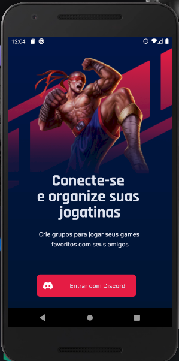
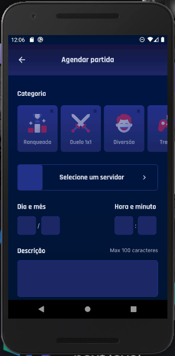
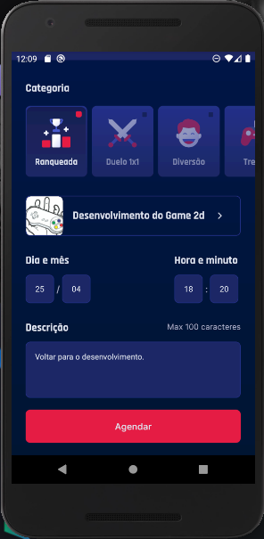
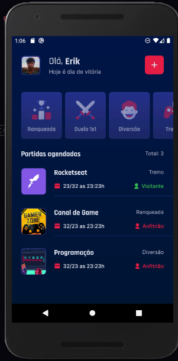
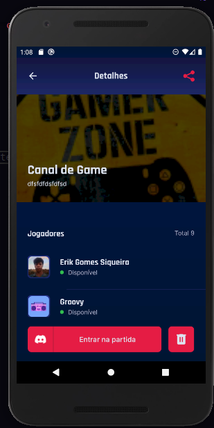
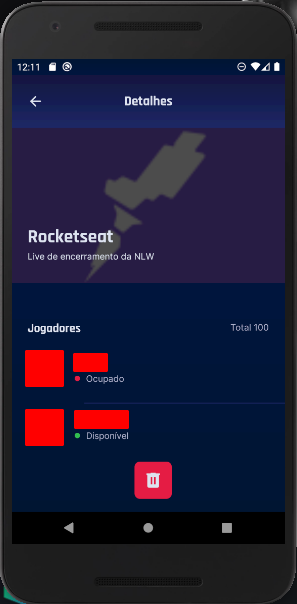
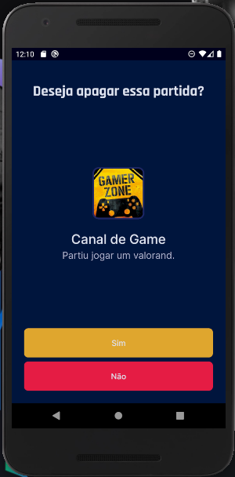
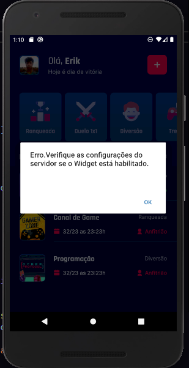
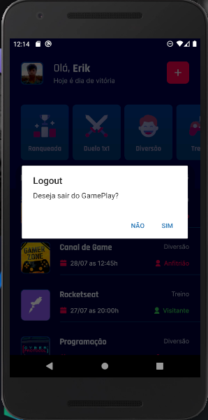

<h1 align="center">
    
</h1>

<h1 align="center">
    📱 GamePlay_nlw_together_react-native ⚛ 
</h1>


<p align="center">Repositório do app Gameplay do NLW together</p>

## 🪧 Sobre o aplicativo

O aplicativo desenvolvido na NLW Together é uma agenda de partidas de jogos e conectado ao Discord, com ele podemos agendar partidas selecionando os servidores e obtendo dados através da ligação com o Discord para: <br>
    • Obter imagens do servidor e fotos de perfil do Discord<br>
    • Obter dados dos servidores da sua conta.<br>
    • Obter membros dos servidores ativos no momento.<br>
    • E várias outras coisas necessárias para seu funcionamento.<br>
E com esses dados criamos e armazenamos as partidas que serão agendadas.<br>

<i>OBS.: O aplicativo não está terminado, <a href="https://github.com/Erik-Gomes-Siqueira/gameplay_nlw_together_react-native/blob/main/README/document/READM.pdf">Clique aqui</a> para ler ou baixar uma explicação mais detalhada sobre ele (como se fosse uma documentação 🤓).</i>

Esse aplicativo foi feito durante a **NLW - Next Level Week** evento oferecida pela <a href="https://rocketseat.com.br/">Rocketseat</a> e com algumas implementações minhas.
O NLW é um evento online com muito conteúdo prático, em que o conteúdo fica disponível durante uma semana. Se puderem participar seja iniciante ou não, participem, ela sempre nos eleva a um próximo nível.


## 🖌📲 Layout

### 🗂 Mobile</br></br>

<p align="center">
  
    
  
    
  
    
  
    
  
  
  
    
  
    
  
    
  
    
  

  


  
</p>


## 🖥 Tecnologias

Ferramentas usadas na construção do projeto:

- <a href="https://expo.io/">Expo</a>
- <a href="https://reactnative.dev">React Native</a>
- <a href="https://www.typescriptlang.org/">TypeScript</a>


## ▶ Como executar o projeto

O aplicativo é simples de ser executado, tudo que precisa é:
1. Configurar o arquivo .env.example corretamente, de acordo com <a href="https://discord.com/developers/applications">Documentação da API do Discord</a>
2. Seguir os passos para a execução do aplicativo no site da <a href="https://docs.expo.io/get-started/installation/">Expo</a> ou pelo video do canal  <a href="https://youtu.be/dB1YAOlMTUI">Sujeito programador</a>
3. Mobile (pasta mobile)

### ⚙ Pré-requisitos

Para executar a aplicação é necessário instalar, você vai precisar ter algumas ferramentas:
  
   • <a href="https://git-scm.com/downloads">Git</a><br>
   • <a href="https://docs.expo.io/get-started/installation/">Expo</a>
 
    
E também é bom ter um bom editor de código, eu indico o  <a href="https://code.visualstudio.com/">VSCode</a>.

### ▶📲 Rodando a aplicação mobile 

```bash
# Clone este repositório
$ git clone https://github.com/Erik-Gomes-Siqueira/gameplay_nlw_together_react-native.git

# Acesse a pasta do projeto no terminal/cmd
$ cd gameplay_nlw_together_react-native

# execute o Expo
$ expo start

# Agora abra o projeto no dispositivo físico ou no emulador.
```
<br>
<p>Essa foi a aplicação que foi passada e as minhas implementações, a aplicação ficou  incrível e espero ter contribuído para ela de alguma forma.<p/>
  
  
## 🗒 Lista de futuras implementações:
- [ ] Modal e pensar em alguma forma mais intuitiva para sair do aplicativo<br>
- [ ] Validação de dados na tela de Registro<br>
- [ ] Função que exclui uma partida agendada<br>
- [ ] Pensar em mais implementações<br>

  
## 😁 Contribua para o projeto

> [Guia de como contribuir no GitHub](https://github.com/firstcontributions/first-contributions)

  <br>

## 📖 Licença

Este projeto esta sobe a licença MIT.

Inspirado no template feito por Thiago Marinho <a href="https://github.com/tgmarinho/README-ecoleta/blob/master/README.md">Exemplo README<a/>


  
  
